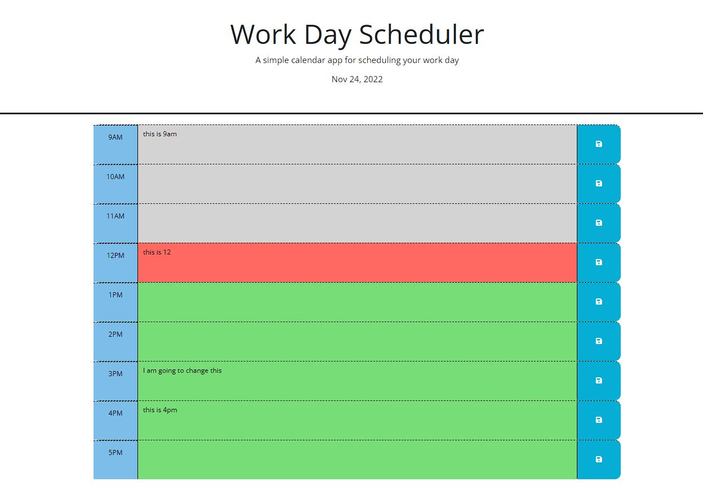

# Challange 05 - Day Planner
## Description

This is a day planner template to show a representative of the calender for today from 9am-5pm. 

## Usage
When loading for the first time you will see today's date as well as time slots for 9am-5pm current time. Any time slots in the past will be gray with the current timeslot being red and future time slots being green. When you type in  information into a slot and hit the save button it will save the information to your local storage for that timeslot. if you reload or travel to another page and back this information will be displayed. Please note if you come back on another day the date will change however it will assume the information in each time slot is the same. You can clear a timeslot by simply deleting the information in the text box and hitting save for that time slot. 

## License

Copyright (c) [2022] [Stephen]

Permission is hereby granted, free of charge, to any person obtaining a copy
of this software and associated documentation files (the "Software"), to deal
in the Software without restriction, including without limitation the rights
to use, copy, modify, merge, publish, distribute, sublicense, and/or sell
copies of the Software, and to permit persons to whom the Software is
furnished to do so, subject to the following conditions:

The above copyright notice and this permission notice shall be included in all
copies or substantial portions of the Software.

THE SOFTWARE IS PROVIDED "AS IS", WITHOUT WARRANTY OF ANY KIND, EXPRESS OR
IMPLIED, INCLUDING BUT NOT LIMITED TO THE WARRANTIES OF MERCHANTABILITY,
FITNESS FOR A PARTICULAR PURPOSE AND NONINFRINGEMENT. IN NO EVENT SHALL THE
AUTHORS OR COPYRIGHT HOLDERS BE LIABLE FOR ANY CLAIM, DAMAGES OR OTHER
LIABILITY, WHETHER IN AN ACTION OF CONTRACT, TORT OR OTHERWISE, ARISING FROM,
OUT OF OR IN CONNECTION WITH THE SOFTWARE OR THE USE OR OTHER DEALINGS IN THE
SOFTWARE.